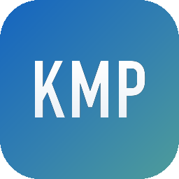
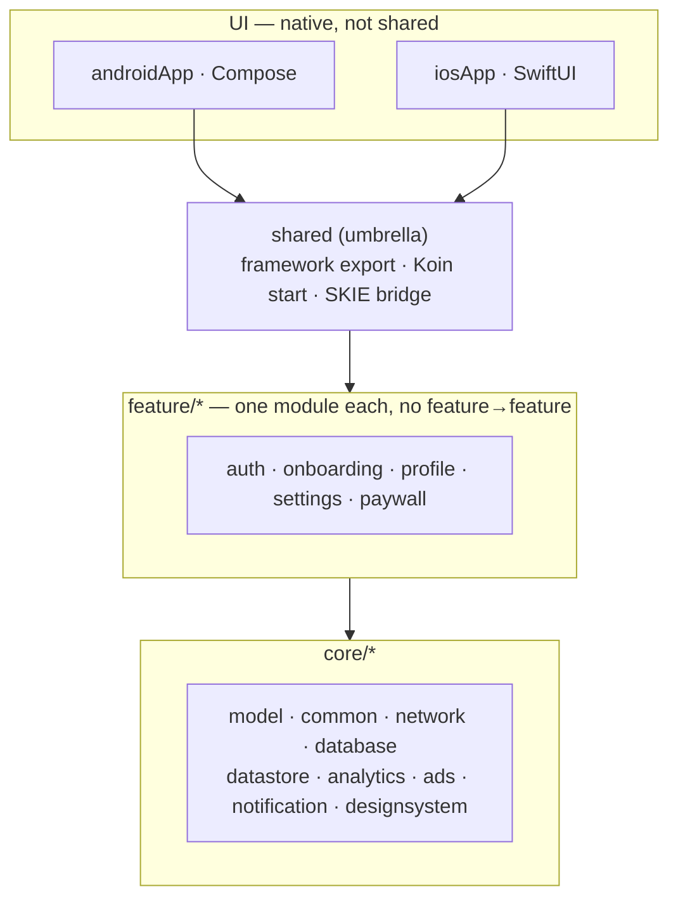

<p align="center">
  
</p>

<h1 align="center">Base KMP Architecture</h1>

A **Kotlin Multiplatform** base to build new apps on: one shared Kotlin core (domain, data, and the
presentation state machine) with **fully native UI** — Jetpack Compose on Android, SwiftUI on iOS.
The groundwork is already in place; start from your own screens and business logic.

<p align="center">
  <a href="https://github.com/yfy/BaseKmpArchitecture/actions/workflows/ci.yml"></a>
  
  
  
  
</p>

---

## Why this exists

Every new mobile app starts with the same groundwork: auth and session handling, networking, DI,
storage, localization, billing, ads, analytics. This repo is that groundwork built once — a base you
develop directly on top of, instead of rebuilding it for every project.

And unlike most "cross-platform" stacks, it does not force a shared UI: the **UI stays 100% native**
while everything below it is shared Kotlin. One place for business logic, network, persistence, and
state — and full control over how each platform looks and feels.

## Features

- **Shared core, native UI** — domain + data + ViewModels in `commonMain`; screens in Compose / SwiftUI.
- **Single-State MVVM** — every screen is one immutable `UiState` over a `StateFlow`, plus optional one-shot effects.
- **Koin DI with environment swap** — `mock` / `dev` / `prod` is a module swap, not branching.
- **SKIE interop** — `StateFlow`/`Flow` become Swift `AsyncSequence`; sealed types become exhaustive Swift enums.
- **Auth done right** — secure token storage (Keychain / EncryptedSharedPreferences), bearer + auto-refresh, 401 handling, a single `SessionManager`.
- **Resilient networking** — Ktor with retry/backoff and offline detection mapped to a typed `AppError`.
- **Design tokens, one source** — colors defined once in JSON, code-generated for both platforms.
- **Deep & universal links**, push routing, in-app WebView, runtime permissions, cross-screen results.
- **Ads (AdMob)** — banner + interstitial + rewarded with GDPR/UMP consent; ships with Google test IDs, off until enabled by a central toggle.
- **Localized** (Turkish + English) with a clean "semantic state, text in the UI" rule.
- **Architecture enforced by tests** — Konsist rules run in CI and fail the build on violations.

---

## Architecture

**One principle: native UI, shared core.** Everything below the UI is shared Kotlin. The UI and
navigation are native and are *not* shared — only the route definitions and a single `parseAppRoute`
function cross the boundary.



A feature is split into four layers, top to bottom:

| Layer | Lives in | Holds |
|---|---|---|
| **presentation** | `commonMain` | `UiState` (immutable) + `UiError` (semantic enum) + `ViewModel` |
| **domain** | `commonMain` | interfaces, sealed outcomes, use cases — pure Kotlin |
| **data** | `commonMain` | `internal` Ktor/Room/DataStore impls + DTOs + mappers |
| **di** | `commonMain` | the feature's Koin module |

**How one screen flows:** UI sends an intent → ViewModel runs a use case → repository returns a
`Flow` of sealed outcomes → ViewModel reduces to one `UiState` (and optionally emits a one-shot
effect) → UI renders it and maps semantic enums to localized text.

### Core principles

1. Prefer `interface + Koin` over `expect/actual`; the latter only for real platform primitives.
2. Exceptions never cross into Swift — flows become sealed phases via `asPhaseFlow()`.
3. ViewModels emit **semantic state only** — never user-facing text.
4. The public/export surface is deliberate (explicit API mode + `internal` default + Konsist).

---

## Project structure

```
core/
  model         pure models + AppRoute + parseAppRoute()
  common        BaseViewModel · AppError · SessionManager · AppEventBus ·
                TokenStore · PermissionController · NavigationResultBus
  network       Ktor client (auth + retry + connectivity); engine expect/actual
  database      Room (KMP)            datastore   DataStore
  analytics     Firebase              notification push + presentation
  ads           AdMob: AdManager (interface + Mock) · Android impl + UMP consent
  designsystem  Compose theme/components (colors generated from design-tokens.json)
feature/        auth · onboarding · profile · settings · paywall
shared/         iOS umbrella framework: exports, startAppKoin(), SKIE StateBridge
androidApp/     Compose app          iosApp/   SwiftUI app (+ DesignSystem Swift Package)
arch-test/      Konsist architecture rules (CI)
design-tokens.json   single source for colors
mock-resources/      mock JSON fixtures (shared by both platforms)
universal-links/     AASA + assetlinks templates
```

---

## Building blocks

**The ViewModel base** (`core:common`)

```kotlin
abstract class BaseViewModel<S, E>(initialState: S) : ViewModel() {
    val state: StateFlow<S>
    val effects: Flow<E>
    protected fun setState(reducer: S.() -> S)
    protected fun emitEffect(effect: E)
}
```

One base for every screen: one immutable `state`, plus an *optional* one-shot `effects` channel for
events that must not live in state (navigation, toast, permission). Screens with no events use
`BaseViewModel<MyState, Nothing>`.

**iOS bridge.** SKIE turns Kotlin flows into Swift `AsyncSequence`; the Swift shells (`StateScreenModel` /
`BaseScreenModel`) hold the VM via `VMOwner` and call `clear()` on `deinit`. The Xcode project uses
file-system synchronized groups — **drop a Swift file under `iosApp/iosApp/**` and it's compiled,
no `.pbxproj` editing.** The iOS design system is a local Swift Package.

**Auth & session.** `SessionManager` is the single source of "logged in". Logout clears the session,
cached user, and tokens, then broadcasts an `AppEvent` so both apps reset to login through one path —
the same path a failed token refresh (401) takes. Tokens live in the Keychain / EncryptedSharedPreferences;
Ktor's bearer plugin loads and refreshes them automatically.

**Networking.** Retry with backoff on 5xx/IO, plus a connectivity check that fails fast when offline.
Everything maps to a typed `AppError` (`NoConnectivity`, `Timeout`, `Network`, `Server`, `Unauthorized`, `Unknown`).
Errors surface through one backend-agnostic currency — `AppError` plus each feature's sealed outcomes —
produced by a single Ktor-HTTP translator, `sendRequest` in `core:network`.

**Design tokens.** Edit `design-tokens.json`, run `./gradlew generateDesignTokens`, and the colors are
regenerated for Compose (`DesignTokens.kt`) and SwiftUI (`DesignTokens.swift`). Never hand-mirror hex.

**Native integrations toggle.** `shared/.../NativeIntegrations.kt` decides in one place which native
SDKs (`revenueCat`, `googleAuth`, `admob`) get wired into Koin, visible from both Kotlin and Swift. A
flag that is off — or a `mock`/`dev` build, or an unconfigured key — means the module is never injected.

**Ads (AdMob).** `core:ads` exposes a callback-based `AdManager` (UMP consent, interstitial, rewarded)
behind the same `interface + Koin` seam as billing, so the impl can be Kotlin (Android) **or Swift**
(iOS). The default binding is a no-op mock; the real impl is injected only when the `admob` toggle is
on. Banners are native UI per platform, and everything ships with **Google test ad unit IDs**.

---

## Getting started

**Prerequisites:** JDK 17, Android SDK (compileSdk 35, minSdk 26), **Xcode 16+** (for SKIE + synchronized groups).

```bash
git clone https://github.com/yfy/BaseKmpArchitecture.git && cd BaseKmpArchitecture
./gradlew :androidApp:assembleDebug
```

**Android**

```bash
./gradlew :androidApp:installMockDebug      # mock flavor on a device/emulator
```

Or open the project in Android Studio and run `androidApp` (flavors: `mock` / `dev` / `prod`).

**iOS**

```bash
cd iosApp
xcodebuild build -scheme iosApp -destination 'platform=iOS Simulator,name=iPhone 16 Pro'
```

Or open `iosApp/iosApp.xcodeproj` in Xcode and run. Environment comes from the Info.plist
`APP_ENVIRONMENT` key (fed by an Xcode build setting; empty resolves to MOCK).

---

## Add a feature

For a feature `wishlist`:

1. Create `feature/wishlist` (`plugins { alias(libs.plugins.kmp.feature) }`) and `include(":feature:wishlist")` in `settings.gradle.kts`.
2. **domain/** — `WishlistRepository` (returns `Flow`), sealed outcomes, use cases.
3. **data/** — `internal class WishlistRepositoryImpl(...)` + `internal` DTOs.
4. **presentation/** — `WishlistUiState`, `WishlistUiError` (enum), `WishlistViewModel : BaseViewModel<WishlistUiState, Nothing>`.
5. **di/** — a Koin module binding the repo (`single`), use cases and VM (`factory`).
6. Register the module in `shared/.../Koin.kt` (`featureModules`), add `getWishlistViewModel()`, and a typed iOS accessor in `shared/iosMain/.../StateBridge.kt`.
7. Add an `AppRoute` case (if navigable), then build the native screens: Android `composable<>` in `AppNavHost`, iOS view + `AppDestination` case + `navigationDestination` branch.
8. Add strings in **both** languages, write `commonTest`, and run `./gradlew :arch-test:test` + both builds.

### Communicating between features

Features never depend on each other. Share through `core`:

- **Types / contracts** → `core:model` or a `core` interface (injected via Koin).
- **Persisted data** → `core:datastore` / `core:database`; the other feature observes a `Flow`.
- **Cross-screen results** → `NavigationResultBus` (`post(key, value)` / `resultsFor(key)`).
- **App-wide events** → `AppEventBus` (`AppEvent.LoggedOut`, `AppEvent.SessionExpired`, …).

---

## Localization

Every user-facing string is provided in **Turkish + English**, with keys aligned across platforms.
ViewModels emit semantic enums / `AppError`; the UI maps them to text.

- Android — `res/values/strings.xml` (TR) + `res/values-en/strings.xml` (EN).
- iOS — `Localizable.xcstrings` (each key has `tr` + `en`); strings are read via the app's `L()` helper.

---

## Testing

```bash
./gradlew :arch-test:test                                   # Konsist architecture rules
./gradlew testDebugUnitTest                                 # all unit tests (JVM)
./gradlew :shared:linkDebugFrameworkIosSimulatorArm64       # iOS framework (+ SKIE)
./gradlew :androidApp:assembleDebug                         # Android build
cd iosApp && xcodebuild test -scheme iosApp -destination 'platform=iOS Simulator,name=iPhone 16 Pro'
```

ViewModel and repository tests live in `commonTest` and run on both platforms; thin XCUITests cover
end-to-end iOS paths. CI (`.github/workflows/ci.yml`) runs arch-test, unit tests, the iOS framework
and app build, and uploads the APK + reports.

---

## Make it yours (placeholders to replace)

Every in-code placeholder — Firebase, RevenueCat, AdMob, Google Sign-In, API base URLs, deep-link
scheme, legal URLs, database & DataStore names — carries the same marker. One search returns the full
checklist; replace every hit with your real value before release:

```bash
grep -rn "TODO(template)" .        # or search TODO(template) in the IDE
```

- **App identity** — `applicationId` / bundle id, the `com.yfy.kmp` package/namespace (project-wide
  rename), `app_name`, the generated app icon, the placeholder login logo and onboarding icons.
- **Storage names** — Room database (`yfy.db`) and DataStore file (`yfy.preferences_pb`).
- **Deep links** — the `yfy://` scheme: shared `AppRoute.toUri()`, the Android manifest scheme, and iOS
  `CFBundleURLSchemes`.
- **Colors** — `design-tokens.json` (then `./gradlew generateDesignTokens`).
- **Backend** — base URLs in `core:network` (`debugNetworkModule` / `prodNetworkModule`). A different
  backend contract (Firebase/Supabase SDK, envelope responses) means writing your own translator next to
  `SendRequest.kt` and keeping `SendRequestTest` green; nothing above the data layer changes.
- **Auth keys** — Google/Apple/Instagram OAuth, RevenueCat keys (currently dummy + mock).
- **AdMob** — the Google **test** app + ad unit ids, all tagged in code; the iOS app id also lives in
  `Info.plist` (see the table below). Ads run only on `prod` builds with the `admob` toggle on.
- **Universal links** — your domain in the manifest + iOS entitlement; host the templates in `universal-links/`.

Config files cannot carry the marker — go through these by hand:

| File | Replace |
|---|---|
| `androidApp/google-services.json` | Firebase Android config (placeholder `package_name`s) |
| `iosApp/iosApp/GoogleService-Info.plist` | Firebase iOS config |
| `iosApp/iosApp/Info.plist` | `GADApplicationIdentifier` (Google test id), `CFBundleURLSchemes` (`yfy`) |
| `universal-links/apple-app-site-association` | `TEAMID` + iOS bundle id |
| `universal-links/assetlinks.json` | Android package name + `sha256_cert_fingerprints` |
| Xcode target settings | iOS bundle identifier (never hand-edit `project.pbxproj`) |
| `iosApp/iosApp.entitlements` | add `applinks:<your-domain>` to enable universal links (currently empty) |

---

## License

MIT — see `LICENSE`.
